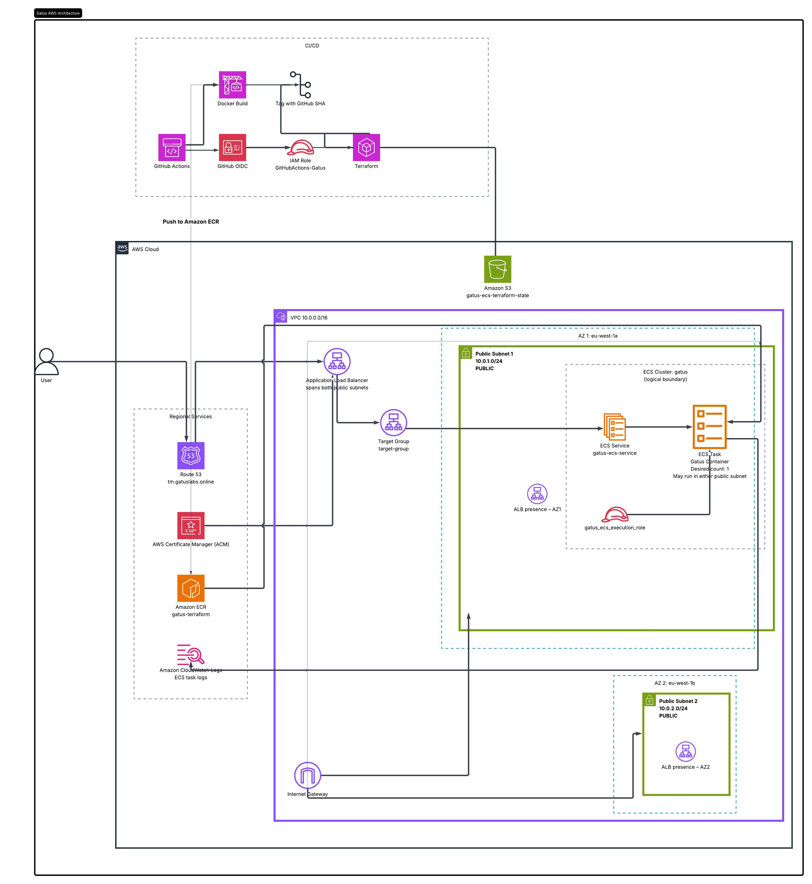
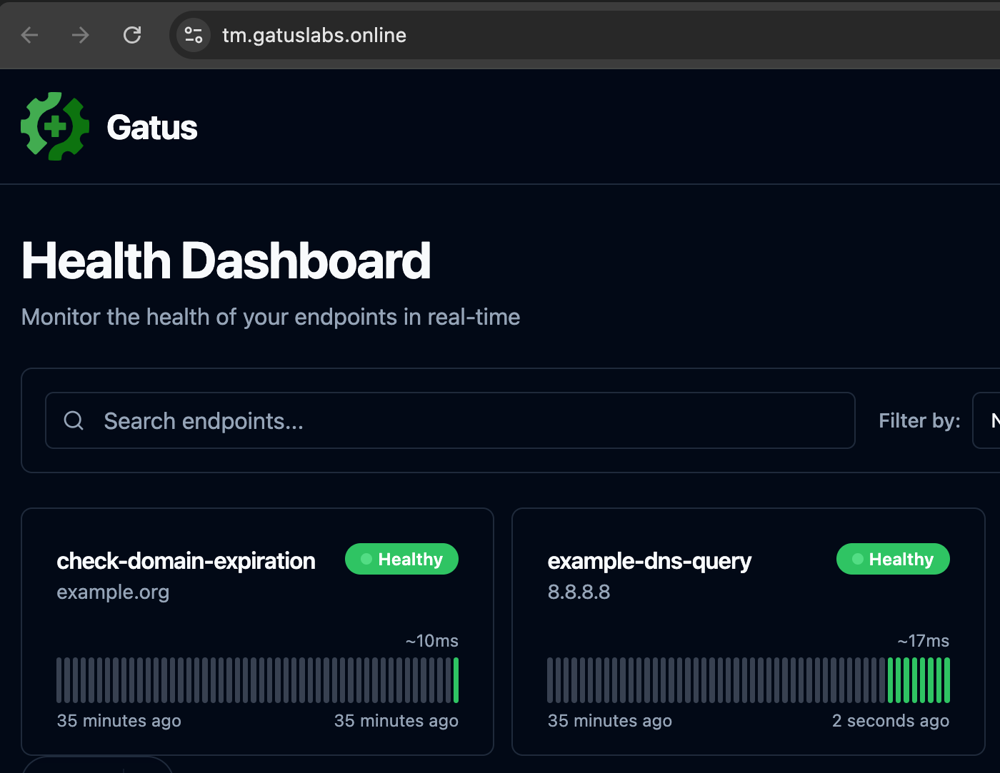
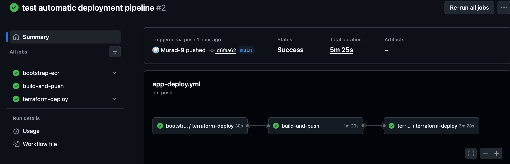
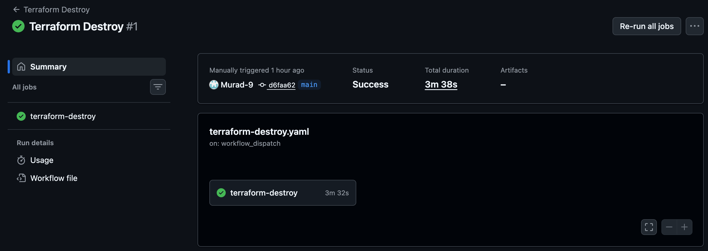

# Gatus AWS Architecture
An end-to-end deployment of Gatus on AWS ECS Fargate, provisioned with Terraform and automatically deployed through GitHub Actions.


## Technology Stack

### AWS & Infrastructure


### Infrastructure as Code & Containers


### CI/CD & Authentication


### Development


## Project Overview


### What is this application?

Gatus is an open-source health monitoring application written in Go. It monitors endpoints such as websites and APIs and displays their availability, response time and health status through a web interface.

For this project, I containerised Gatus using my own multi-stage Dockerfile and deployed it to AWS ECS Fargate. The application runs on port 8080 behind an Application Load Balancer and is accessed through the custom domain `tm.gatuslabs.online` over HTTPS.

The infrastructure is provisioned using Terraform and the deployment process is automated using GitHub Actions. Docker images are built and tagged using the Git commit SHA before being pushed to Amazon ECR and deployed to ECS.


### Why did I choose Gatus?

I chose Gatus because it is a lightweight application that works well in a containerised environment while still giving me the opportunity to build a realistic cloud deployment around it.

Rather than focusing mainly on application development, I wanted this project to focus on DevOps skills such as Docker, Terraform, AWS networking, ECS, load balancing, HTTPS, CI/CD and secure authentication.


### Why did I host it on ECS?


I chose ECS Fargate because I wanted to deploy and manage a containerised application without having to manage the underlying EC2 servers.

Using a traditional virtual machine would mean provisioning the server, installing Docker, managing the operating system and maintaining the instance myself. Fargate allows AWS to manage the underlying compute while I focus on the container, networking and infrastructure configuration.

Services such as Vercel or Netlify would make deployment simpler, but they would abstract away many of the AWS and DevOps concepts that I wanted to practise in this project.

Using ECS allowed me to work directly with services such as ECR, IAM, VPC networking, Application Load Balancers, CloudWatch and Terraform.


### How many users am I expecting?

This is a portfolio and learning project rather than a production application with a large user base, so I expect very low traffic.

Because of this, the ECS service is configured with a desired count of one Fargate task. The Application Load Balancer still spans two Availability Zones, and the ECS service is configured with both public subnets so the task can be placed in either Availability Zone.

If the application needed to support significantly more traffic in the future, the architecture could be extended by increasing the number of ECS tasks and introducing ECS Service Auto Scaling.


## Architecture

The infrastructure is configured for AWS `eu-west-1` using Terraform.

When deployed, the application runs on Amazon ECS Fargate inside a custom VPC with two public subnets across two Availability Zones. An internet-facing Application Load Balancer distributes traffic to the ECS service, while Route 53 provides DNS and AWS Certificate Manager provides HTTPS.

Docker images are built through GitHub Actions, tagged with the Git commit SHA and pushed to Amazon ECR. ECS then runs the image as a Fargate task.

Terraform uses an encrypted Amazon S3 backend with native state locking to store and protect the remote Terraform state. Application logs are sent from ECS to Amazon CloudWatch Logs.

<p align="center">
  
</p>


## Project Structure

The repository is organised into separate areas for the application, infrastructure, CI/CD and project documentation.


```text
ECS-Gatus-AWS-Infrastructure/
│
├── .github/
    └── workflows/
        ├── app-deploy.yml
        ├── terraform-deploy.yaml
        └── terraform-destroy.yaml
│
├── app/
│   ├── main.go
│   ├── config.yaml
│   ├── go.mod
│   ├── go.sum
│   └── ...Gatus application source code
│
├── assets/
│   └── architecture/
│       └── GATUS_AWS.jpeg
│
├── infra/
│   ├── modules/
│   │   ├── acm/
│   │   │   ├── main.tf
│   │   │   ├── outputs.tf
│   │   │   └── variables.tf
│   │   │
│   │   ├── alb/
│   │   │   ├── main.tf
│   │   │   ├── outputs.tf
│   │   │   └── variables.tf
│   │   │
│   │   ├── ecr/
│   │   │   ├── main.tf
│   │   │   └── outputs.tf
│   │   │
│   │   ├── ecs/
│   │   │   ├── main.tf
│   │   │   └── variables.tf
│   │   │
│   │   ├── route53/
│   │   │   ├── main.tf
│   │   │   ├── outputs.tf
│   │   │   └── variables.tf
│   │   │
│   │   └── vpc/
│   │       ├── main.tf
│   │       └── outputs.tf
│   │
│   ├── backend.tf
│   ├── main.tf
│   └── variables.tf
│
├── Dockerfile
├── .dockerignore
├── .gitignore
└── README.md
``` 

- **`app/`** contains the Gatus application source code and configuration.
- **`infra/`** contains the Terraform configuration and reusable infrastructure modules.
- **`.github/workflows/`** contains the GitHub Actions CI/CD workflows.
- **`assets/`** contains images used by the README, including the architecture diagram.
- **`Dockerfile`** contains the multi-stage container build used to package Gatus.


## From ClickOps to Infrastructure as Code

Before building the final infrastructure with Terraform, I first deployed the architecture manually through the AWS Console.

This helped me understand how the individual AWS services connected before trying to automate everything.

During the ClickOps stage I worked with services including:

- VPC networking, public subnets, routing and an Internet Gateway
- Amazon ECR for storing the Docker image
- Amazon ECS with Fargate
- ECS task definitions and services
- Application Load Balancer and target groups
- Security groups
- Route 53
- AWS Certificate Manager for HTTPS
- CloudWatch logging

Once I had the application working manually, I removed the manually created resources and rebuilt the infrastructure using reusable Terraform modules.

The final stage was automating the deployment with GitHub Actions so that changes to the application could build a new Docker image, push it to ECR and apply any required infrastructure changes and deploy the updated ECS service.

This gave me experience with the same architecture through three stages:

**ClickOps → Terraform → CI/CD**


## Implementation Walkthrough

### 1. Containerising Gatus

I started by creating my own multi-stage Dockerfile for Gatus.

The build stage uses a Go Alpine image to install dependencies and compile the application. The final stage uses a minimal `scratch` image so the runtime container only contains what it needs.

I also run the application as a non-root user instead of root.

Gatus listens on port `8080`. ECS exposes this container port, while the Application Load Balancer receives traffic on ports `80` and `443` and forwards requests through the target group to the ECS task on port `8080`.

### 2. Building the AWS Network

I created a custom VPC using the CIDR range `10.0.0.0/16`.

Inside the VPC I created two public subnets across two Availability Zones:

- `10.0.1.0/24` in `eu-west-1a`
- `10.0.2.0/24` in `eu-west-1b`

Both subnets use a route table with a default route through an Internet Gateway.

For this project I chose public subnets rather than private subnets with a NAT Gateway to keep the architecture simpler and avoid the extra NAT Gateway cost.

The ECS task still isn't directly open on port `8080` because its security group only allows traffic from the ALB security group.

### 3. Deploying with ECS Fargate

I used ECS Fargate to run the Gatus container without having to manage the underlying EC2 instances.

The ECS service is configured with:

- `desired_count = 1`
- `0.25 vCPU`
- `512 MiB` memory
- Port `8080`

A desired count of `1` means ECS keeps one Gatus task running.

The service is configured with both public subnets, so AWS can place the task in either Availability Zone.


### 4. Adding the Application Load Balancer

I added an internet-facing Application Load Balancer across both public subnets to provide a single entry point for the application.

The ALB receives incoming web traffic and forwards it to the ECS task through a target group.

The target group uses `ip` as its target type because Fargate tasks use their own network interfaces and IP addresses. Traffic is forwarded to the Gatus container on port `8080`.

I configured the target group to use `/health` for health checks. This allows the ALB to check whether the Gatus task is healthy before sending traffic to it.

The ALB security group allows inbound traffic on ports `80` and `443`, while the ECS security group only allows traffic on port `8080` when it comes from the ALB security group.


### 5. Adding a Custom Domain and HTTPS

I used Route 53 to connect the custom domain `tm.gatuslabs.online` to the Application Load Balancer.

The Route 53 `A` record is configured as an alias to the ALB, so requests to the domain are sent to the load balancer.

I used AWS Certificate Manager to request an SSL/TLS certificate for `tm.gatuslabs.online`.

The certificate uses DNS validation, and Terraform creates the required Route 53 validation record automatically.

The ALB has an HTTPS listener on port `443` using the ACM certificate. Requests arriving on port `80` are redirected to HTTPS on port `443`.

This means the application can be accessed securely through the custom domain rather than directly through the ALB DNS name.


### 6. Terraform Modules and Remote State

I initially built the Terraform configuration in a single file so I could get the infrastructure working and understand how the resources connected.

Once the deployment was working, I refactored the configuration into separate modules for the VPC, ECS, ECR, Application Load Balancer, Route 53 and ACM.

This made the infrastructure easier to read, maintain and reuse.

The root Terraform configuration connects these modules together by passing outputs between them. For example, the VPC module provides the VPC and subnet IDs required by the ALB and ECS modules, while the ECR module provides the repository URL used by the ECS task definition.

Instead of storing the Terraform state locally, I configured an Amazon S3 remote backend.

The state is stored in the `gatus-ecs-terraform-state` S3 bucket with encryption enabled.

I also enabled native S3 state locking using `use_lockfile = true`. This prevents multiple Terraform processes from changing the same state at the same time, reducing the risk of conflicting changes or state corruption.

The S3 backend bucket is separate from the Terraform-managed application infrastructure. This means `terraform destroy` removes the AWS resources tracked in the state, but it does not remove the backend bucket itself.

The backend remains available so Terraform can continue storing the updated state after the infrastructure has been destroyed. For example, after running the destroy workflow, `terraform state list` returned no managed resources while the S3 backend still remained available.


### 7. Automating Deployment with GitHub Actions and OIDC

I separated the CI/CD process into three GitHub Actions workflows so that each workflow has a clear responsibility.

The `app-deploy.yml` workflow handles the application deployment process. When application files change on the `main` branch, it starts automatically.

On a fresh deployment, the workflow first calls the reusable Terraform deployment workflow with `ecr_only` enabled. This creates the Amazon ECR repository before the Docker image is built, so there is somewhere for the image to be pushed.

The application workflow then builds the Docker image, tags it using the Git commit SHA and pushes it to Amazon ECR.

Once the image is available in ECR, the application workflow calls `terraform-deploy.yaml` again for the full infrastructure deployment.

The Terraform workflow runs:

- `terraform init`
- `terraform validate`
- `terraform plan`
- `terraform apply`

Terraform then provisions the infrastructure through the reusable modules, including the VPC, ECS service, ECR repository, Application Load Balancer, ACM certificate and Route 53 records.

Docker images are tagged using the Git commit SHA instead of only using a `latest` tag. This allows the deployed image to be traced back to the exact Git commit that created it.

For AWS authentication, I use OpenID Connect (OIDC) instead of storing long-lived AWS access keys in GitHub.

GitHub Actions assumes the `GitHubActions-Gatus` IAM role and receives temporary AWS credentials for each workflow run.

I also created a separate `terraform-destroy.yaml` workflow.

The destroy workflow is intentionally manual because infrastructure destruction should not happen automatically when code is pushed.

Although I could run `terraform destroy` from my local terminal, using GitHub Actions makes the destroy process repeatable, documented and visible inside the repository. It also uses the same OIDC authentication process instead of depending on AWS credentials configured on my local machine.

The destroy workflow initialises Terraform, creates a destroy plan and then applies that plan to remove the Terraform-managed AWS infrastructure.

Documentation and workflow-only changes do not trigger an application deployment, which prevents unnecessary infrastructure changes and AWS usage.


## Local Setup

### Prerequisites

To run the application locally, you need:

- Git
- Docker

To work with the Terraform configuration, you also need:

- Terraform
- AWS CLI
- AWS credentials with access to the required AWS resources

### Clone the Repository

```bash
git clone git@github.com:Murad-9/ECS-Gatus-AWS-Infrastructure.git
cd ECS-Gatus-AWS-Infrastructure
```

### Run Gatus Locally with Docker

Build the Docker image from the root of the repository:

```bash
docker build -t gatus-local .
```

Run the container:

```bash
docker run --rm -p 8080:8080 gatus-local
```

Gatus can then be accessed locally on port `8080`.

### Validate the Terraform Configuration

From the `infra` directory:

```bash
cd infra
terraform init
terraform validate
```

This project uses an Amazon S3 remote backend, so Terraform connects to the configured backend during initialisation.

### AWS Deployment

The AWS deployment is handled through GitHub Actions rather than requiring the full deployment to be run manually from a local terminal.

Application changes pushed to the `main` branch trigger the Application Deploy workflow. The workflow:

1. Creates the ECR repository through Terraform if required
2. Builds the Docker image
3. Tags the image using the Git commit SHA
4. Pushes the image to Amazon ECR
5. Runs the full Terraform deployment

The deployment expects the supporting AWS setup to already exist, including the S3 Terraform backend, Route 53 hosted zone and the GitHub OIDC IAM role used by GitHub Actions.


## App Demo

When deployed, Gatus is available through the custom domain over HTTPS.

<p align="center">
  
</p>

## CI/CD Evidence

The application deployment pipeline was successfully triggered by a push to `main`. The workflow bootstrapped ECR, built and pushed the Docker image, and then deployed the full Terraform infrastructure.

<p align="center">
  
</p>

## Terraform Destroy

The Terraform destroy workflow is manually triggered and removes the Terraform-managed AWS infrastructure.

<p align="center">
  
</p>


## Challenges and Lessons Learned

### GitHub OIDC Trust Policy

One of the first issues I faced was getting GitHub Actions to authenticate with AWS using OIDC.

The workflow was able to request an OIDC token, but AWS was rejecting the `AssumeRoleWithWebIdentity` request because the IAM role trust policy did not correctly match the GitHub repository and branch.

I fixed this by updating the trust policy so that it allowed the `main` branch of this repository.

This helped me understand that OIDC authentication depends on both sides being configured correctly. GitHub can generate the token, but AWS still needs to trust the exact repository and branch that is requesting access.

### Missing Gatus Configuration Inside the Docker Image

At one point, the container was being built successfully but Gatus was not working correctly because `config.yaml` was missing from the image.

I discovered that the file was being excluded by my Git configuration, which meant it was never available during the Docker build in GitHub Actions.

After correcting this, I was able to copy the configuration file into the final image and set `GATUS_CONFIG_PATH` so Gatus could locate it.

This taught me to check the full path from source code to container image rather than assuming that a successful Docker build means every required file is present.

### ALB 503 Caused by an ECS Image Tag Mismatch

At one stage, the Application Load Balancer returned a `503 Service Unavailable` response because there were no healthy ECS tasks behind it.

After checking the ECS task events, I found that the task was failing with a container image pull error. GitHub Actions had pushed the Docker image to ECR using the Git commit SHA, while the ECS task definition was still trying to pull the `latest` tag.

Because the `latest` image did not exist, the ECS task could not start. With no running healthy task in the target group, the ALB had nowhere to route requests and returned a `503`.

I fixed this by passing the Git commit SHA into Terraform as the `image_tag` variable and configuring the ECS task definition to use:

`repository_url:image_tag`

This meant ECS deployed the exact image that GitHub Actions had just pushed.

This helped me understand how a problem in the image deployment process can appear as an ALB error further down the request path.

### Bootstrapping ECR Before Deployment

I also ran into a deployment-order problem with ECR.

The Docker image needed to be pushed to ECR before ECS could deploy it, but the ECR repository itself was managed by Terraform.

To solve this, I made the application workflow call the Terraform workflow first with an `ecr_only` option. This creates the repository before the Docker image is built and pushed.

After the image is available, the workflow calls Terraform again to deploy the full infrastructure.

This was one of the most useful parts of the project because it made me think about dependencies between the CI/CD pipeline and the infrastructure it is deploying.

### Terraform State During Repeated Builds and Destroys

While building the project, I had to destroy and recreate the infrastructure several times as I changed the networking, ECS, load balancer and other parts of the architecture.

This caused problems when the Terraform state did not match what I expected to exist in AWS. At one point I also encountered situations where Terraform reported that there was nothing to destroy even though I had previously created infrastructure.

This made me realise how important Terraform state is. Terraform does not simply look at AWS and decide what to manage. It relies on its state file to keep track of the resources that belong to the configuration.

To make this more reliable, I configured an Amazon S3 remote backend with encryption and native state locking. This meant the state was stored centrally rather than depending on a local state file on my machine.

It became especially useful because I could deploy infrastructure through GitHub Actions, destroy it through a separate GitHub Actions workflow, and still have both workflows using the same Terraform state.

After testing the final destroy workflow, I ran `terraform init` locally to reconnect to the S3 backend and then ran `terraform state list`. The command returned no managed resources, confirming that the Terraform-managed infrastructure had been successfully removed.

This was one of the parts of the project that helped me understand Terraform beyond simply writing `.tf` files. I learnt that managing the lifecycle and state of infrastructure is just as important as creating the resources themselves.


## Future Improvements

Although the project meets its current requirements, there are several ways I could improve the architecture further.

One improvement would be moving the ECS tasks into private subnets while keeping the Application Load Balancer in public subnets. This would reduce the direct exposure of the application tasks and make the network design closer to a production environment.

I could also increase the ECS desired count from one task to two or more tasks across multiple Availability Zones. This would improve availability and allow the service to continue operating if one task or Availability Zone became unavailable.

Another improvement would be adding ECS Service Auto Scaling so that the number of running tasks could automatically increase or decrease depending on application demand.

For the CI/CD pipeline, I could add a separate pull request workflow that runs checks such as `terraform fmt`, `terraform validate` and `terraform plan` before changes are merged into the `main` branch.

I could also introduce security and quality tools such as Trivy for container image scanning and Checkov or TFLint for Terraform configuration checks.

For monitoring, I could add CloudWatch alarms for conditions such as unhealthy ALB targets, ECS task failures or high resource usage, with notifications through Amazon SNS.

Finally, I could add an ECR lifecycle policy to automatically remove older Docker images and reduce unnecessary storage over time.